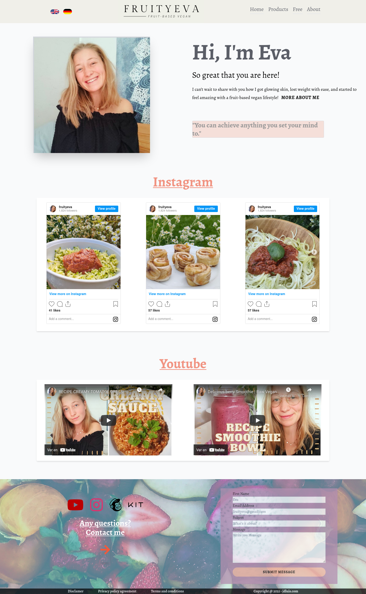

# Client-FruityEva
 Life Style Web Page for Eva Buchmann. ---> https://www.fruityeva.com
 
 Main technologies used: TAILWIND CLI. ---> https://tailwindcss.com/
 
 What problems have I seen creating the web in this way?:
 -I learned the importance of making the web by components. Without them a change in the footer can mean changing every footer on every page.
 -Sometimes the library limits me in what I wanted to do, I learned that tailwindcss is for projects destined to launch an app or simpler products.
 -Most importantly, to handle webs with several pages, it is better to use vue with nuxt or some technology that allows you to work in sections.
 
 Commentary of the client:
 
 "I am very impressed with the creation of my website. It turned out better than I was expecting."
 -Eva Buchmann, fruityeva

 
